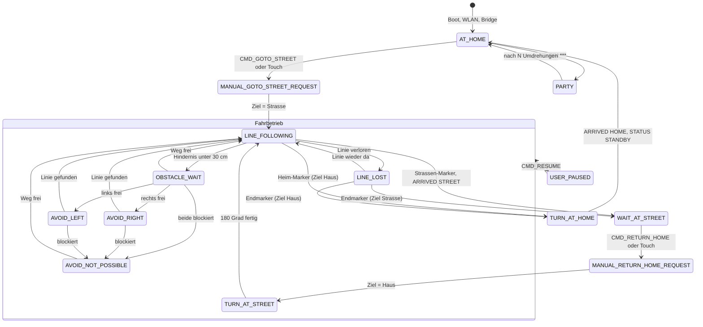

# Design-Prompt: Pico-Zustandsdiagramm (schöne Version)

Vorlage, um aus der Pico-State-Machine ein **hochwertig gestaltetes Zustandsdiagramm**
zu bauen — für KI-Design-/Diagramm-Tools (FigJam AI, Eraser.io, Napkin.ai, tldraw,
Excalidraw, Miro AI) oder zum Einfügen in einen LLM, der SVG/Figma erzeugt.
Enthält **alle** Zustände, **alle** Übergänge und die visuellen Bau-Vorgaben.
Quelle: `Quellcode/Client/global_controller_test.py` (Stand 2026-07-04).

> Viele Tools importieren **Mermaid** direkt — dann Abschnitt „Mermaid-Quelle" ganz
> unten nehmen und danach visuell verfeinern. Für KI-Tools den „Copy-Paste-Prompt"
> nutzen.

---

## 1. Was gebaut werden soll

Ein **UML-artiges Zustandsdiagramm (state machine)** der Steuerungs-Firmware einer
autonomen Mülltonne. Fluss von oben nach unten: Start → Ruhe → Fahrt zur Straße →
Warten → Rückfahrt → Ruhe. Der Fahr-Teil ist eine **verschachtelte Gruppe**
(composite state) „Fahrbetrieb". Nebenzweige: Party-Modus und Pause.

Stil: klar, modern, flach (keine Verläufe/Schatten-Orgien), großzügiger Weißraum,
kräftige aber ruhige Farbcodierung nach Zustandsart, dünne Verbindungslinien mit
klaren Pfeilspitzen, gut lesbare Kantenbeschriftung.

---

## 2. Zustände (Knoten)

| Zustand (ID) | Kategorie | Farbe | Bedeutung |
|---|---|---|---|
| `AT_HOME` | Ruhe | Grün `#16a34a` | Zuhause, Motoren aus, wartet auf Befehl. Sendet extern `STATUS:STANDBY`. |
| `MANUAL_GOTO_STREET_REQUEST` | Anforderung | Lila `#7c3aed` | „Fahre zur Straße" angenommen, startet Fahrt. |
| `MANUAL_RETURN_HOME_REQUEST` | Anforderung | Lila `#7c3aed` | „Fahre nach Hause" angenommen, startet Rückfahrt. |
| `LINE_FOLLOWING` | Fahrbetrieb | Blau `#2563eb` | Folgt der Linie (Hauptfahrzustand). |
| `LINE_LOST` | Fahrbetrieb | Blau-hell `#60a5fa` | Linie kurz verloren, sucht sie. |
| `OBSTACLE_WAIT` | Fahrbetrieb | Orange `#ea580c` | Hindernis < 30 cm, hält an. Extern `STATUS:OBSTACLE`. |
| `AVOID_RIGHT` | Fahrbetrieb | Türkis `#0d9488` | Umfährt Hindernis rechts. |
| `AVOID_LEFT` | Fahrbetrieb | Türkis `#0d9488` | Umfährt Hindernis links. |
| `AVOID_NOT_POSSIBLE` | Fahrbetrieb | Rot `#dc2626` | Beide Seiten blockiert, kommt nicht weiter. |
| `TURN_AT_STREET` | Fahrbetrieb | Blau `#2563eb` | 180°-Drehung an der Straße vor der Rückfahrt. |
| `WAIT_AT_STREET` | Warten | Gelb `#ca8a04` | An der Abholposition, Motoren aus. Extern `STATUS:WAIT_AT_STREET`. |
| `TURN_AT_HOME` | Übergang | Blau `#2563eb` | 180°-Drehung zuhause am Ende der Rückfahrt. |
| `USER_PAUSED` | Pause | Grau `#64748b` | Vom Bediener angehalten. |
| `PARTY` | Easter-Egg | Pink `#db2777` | Dreht sich auf der Stelle + Buzzer-Jingle. |

Zusätzlich: **Start-Pseudozustand** (ausgefüllter schwarzer Kreis) → `AT_HOME`.

**Verschachtelte Gruppe „Fahrbetrieb"** (großer abgerundeter Container um diese
Zustände): `LINE_FOLLOWING`, `LINE_LOST`, `OBSTACLE_WAIT`, `AVOID_RIGHT`,
`AVOID_LEFT`, `AVOID_NOT_POSSIBLE`, `TURN_AT_STREET`. Dünne Umrandung, sehr heller
Blau-Hintergrund (`#eff6ff`), Titel „Fahrbetrieb (lokale Fahr-State-Machine)" oben links.

---

## 3. Alle Übergänge (Verbindungen)

Format: `Quelle → Ziel : Auslöser`. Auslöser fett auf die Kante.

**Start & Ruhe**
1. `● (Start)` → `AT_HOME` : Boot · WLAN · TCP-Bridge verbunden
2. `AT_HOME` → `MANUAL_GOTO_STREET_REQUEST` : `CMD_GOTO_STREET` oder Touch „Abholung"
3. `AT_HOME` → `PARTY` : PIN-Code `***`
4. `PARTY` → `AT_HOME` : nach N vollen Umdrehungen (~10 s)
5. `MANUAL_GOTO_STREET_REQUEST` → `LINE_FOLLOWING` : Ziel = Straße

**Fahrbetrieb (innerhalb der Gruppe)**
6. `LINE_FOLLOWING` → `LINE_LOST` : Linie verloren (Position None)
7. `LINE_LOST` → `LINE_FOLLOWING` : Linie wieder erkannt
8. `LINE_FOLLOWING` → `OBSTACLE_WAIT` : Hindernis vorne < 30 cm
9. `OBSTACLE_WAIT` → `LINE_FOLLOWING` : Weg wieder frei
10. `OBSTACLE_WAIT` → `AVOID_RIGHT` : rechts frei
11. `OBSTACLE_WAIT` → `AVOID_LEFT` : links frei
12. `OBSTACLE_WAIT` → `AVOID_NOT_POSSIBLE` : beide Seiten blockiert
13. `AVOID_RIGHT` → `LINE_FOLLOWING` : Linie wiedergefunden
14. `AVOID_LEFT` → `LINE_FOLLOWING` : Linie wiedergefunden
15. `AVOID_RIGHT` → `AVOID_NOT_POSSIBLE` : blockiert
16. `AVOID_LEFT` → `AVOID_NOT_POSSIBLE` : blockiert
17. `AVOID_NOT_POSSIBLE` → `LINE_FOLLOWING` : Weg frei
18. `TURN_AT_STREET` → `LINE_FOLLOWING` : 180°-Drehung fertig

**Ankunft, Warten, Rückfahrt**
19. `LINE_FOLLOWING` → `WAIT_AT_STREET` : Straßen-Endmarker (Ziel=Straße) · sendet `ARRIVED: STREET`
20. `LINE_LOST` → `WAIT_AT_STREET` : Endmarker beim Wiederfinden (Ziel=Straße)
21. `WAIT_AT_STREET` → `MANUAL_RETURN_HOME_REQUEST` : `CMD_RETURN_HOME` oder Touch „Heim"
22. `MANUAL_RETURN_HOME_REQUEST` → `TURN_AT_STREET` : Ziel = Haus
23. `LINE_FOLLOWING` → `TURN_AT_HOME` : Heim-Endmarker (Ziel=Haus)
24. `LINE_LOST` → `TURN_AT_HOME` : Endmarker beim Wiederfinden (Ziel=Haus)
25. `TURN_AT_HOME` → `AT_HOME` : Home-Marker/Timeout · sendet `ARRIVED: HOME`

**Pause & Not-Stopp**
26. `Fahrbetrieb` (Gruppe, aus jedem Fahr-Zustand) → `USER_PAUSED` : `CMD_STOP`
27. `USER_PAUSED` → `Fahrbetrieb` (vorheriger Zustand) : `CMD_RESUME`
28. beliebiger Zustand → `AT_HOME` : interner Not-Stopp `stop()`

---

## 4. Externe STATUS-Zuordnung (optionale Beschriftung/Legende)

Was der Pico je Zustand **über die Bridge** meldet (interne ≠ Wire-Namen):
- `AT_HOME`, `PARTY` → `STATUS:STANDBY`
- `OBSTACLE_WAIT` → `STATUS:OBSTACLE`
- `LINE_LOST`, `TURN_AT_STREET`, `TURN_AT_HOME`, `AVOID_*` → `STATUS:LINE_FOLLOWING`
- `LINE_FOLLOWING` → `STATUS:LINE_FOLLOWING`
- `WAIT_AT_STREET` → `STATUS:WAIT_AT_STREET`
- `MANUAL_*_REQUEST` → gleichnamiges `STATUS:MANUAL_..._REQUEST`

Als kleine graue Fußnote/Info-Box am Rand darstellen (nicht auf jede Kante).

---

## 5. Visuelle Vorgaben (Bau-Elemente)

- **Knotenform:** abgerundete Rechtecke (radius ~10 px), gefüllt mit Kategorie-Farbe
  in heller Tönung (Fill ~15 % Deckkraft der Farbe), Rand in Vollfarbe (1.5 px),
  Titel in der dunkelsten Tönung derselben Farbe (**nie** reines Schwarz/Grau).
- **Start:** kleiner ausgefüllter Kreis (⌀ 14 px, schwarz/`#111`).
- **Gruppe „Fahrbetrieb":** großer Container-Rahmen, sehr heller Blau-Hintergrund,
  Titel-Label oben links, umschließt die 7 Fahr-Zustände.
- **Kanten:** dünne Linien (1.5 px, `#6b7280`), klare Pfeilspitze; bevorzugt
  orthogonal oder sanft gerundet; keine Überkreuzungen wenn vermeidbar.
- **Kantenlabel:** kleiner Text (12–13 px), Trigger in `monospace` wenn Befehl
  (`CMD_...`), sonst normal; mit leichter heller Hinterlegung, damit über Linien lesbar.
- **Happy-Path hervorheben:** die Spine
  `AT_HOME → MANUAL_GOTO_STREET_REQUEST → LINE_FOLLOWING → WAIT_AT_STREET →
  MANUAL_RETURN_HOME_REQUEST → TURN_AT_STREET → … → TURN_AT_HOME → AT_HOME`
  mit etwas dickerer Linie (2.5 px) und dunklerem Grau, damit der Normalablauf sofort erkennbar ist.
- **Layout:** Top-to-Bottom. `PARTY` als Seitenzweig rechts von `AT_HOME`,
  `USER_PAUSED` als Seitenzweig neben der Fahrbetrieb-Gruppe.
- **Typografie:** serifenlos (z.B. Inter/IBM Plex Sans), Titel 15–16 px medium,
  Labels 12–13 px. Sentence case, keine Versalien außer den Zustands-IDs.
- **Legende:** kleine Box unten mit Farb-Chips → Kategorie
  (Ruhe / Anforderung / Fahrbetrieb / Warten / Pause / Easter-Egg).
- **Format:** exportierbar als **SVG** (skaliert scharf für Poster/Doku).

---

## 6. Copy-Paste-Prompt für ein KI-Design-Tool

> Erstelle ein hochwertiges, modernes **UML-Zustandsdiagramm** einer autonomen
> Mülltonnen-Firmware. Fluss top-to-bottom. Verwende abgerundete Rechtecke als
> Zustände, farbcodiert nach Kategorie (Ruhe = grün, Anforderung = lila,
> Fahrbetrieb = blau, Warten = gelb, Pause = grau, Easter-Egg = pink; helle Füllung,
> kräftiger Rand, dunkler Text derselben Farbe). Ein Start-Punkt (schwarzer Kreis)
> zeigt auf „AT_HOME". Umschließe die sieben Fahr-Zustände (LINE_FOLLOWING,
> LINE_LOST, OBSTACLE_WAIT, AVOID_RIGHT, AVOID_LEFT, AVOID_NOT_POSSIBLE,
> TURN_AT_STREET) mit einem hellblauen Gruppen-Container „Fahrbetrieb". Zeichne alle
> Übergänge als dünne Pfeile mit den Trigger-Labels aus der folgenden Liste; hebe den
> Normalablauf (AT_HOME → zur Straße → warten → zurück → AT_HOME) mit dickeren,
> dunkleren Pfeilen hervor. Füge unten eine Farb-Legende hinzu. Flaches, klares
> Design, viel Weißraum, als SVG exportierbar. Zustände und Übergänge: [hier
> Abschnitt 2 + 3 einfügen].

---

## 7. Mermaid-Quelle (Import-Fallback)

Viele Tools (Eraser, tldraw, Excalidraw, draw.io, Mermaid Live Editor) importieren das direkt:

